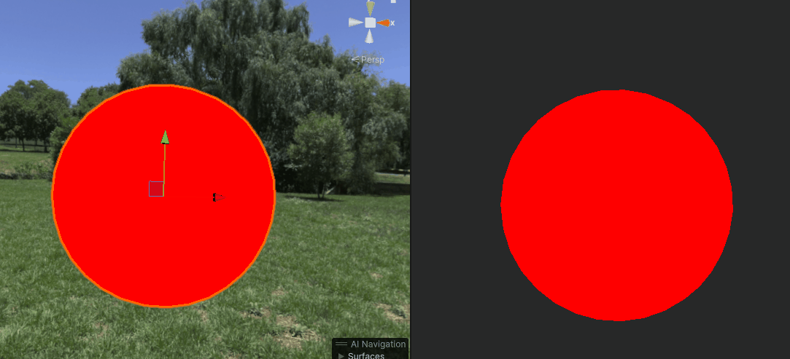
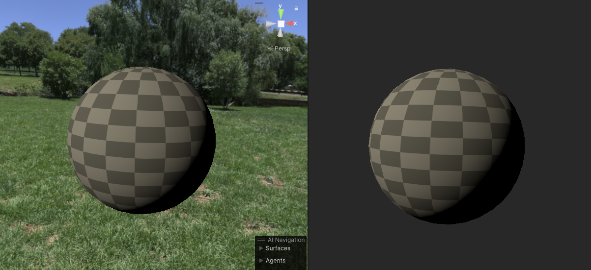
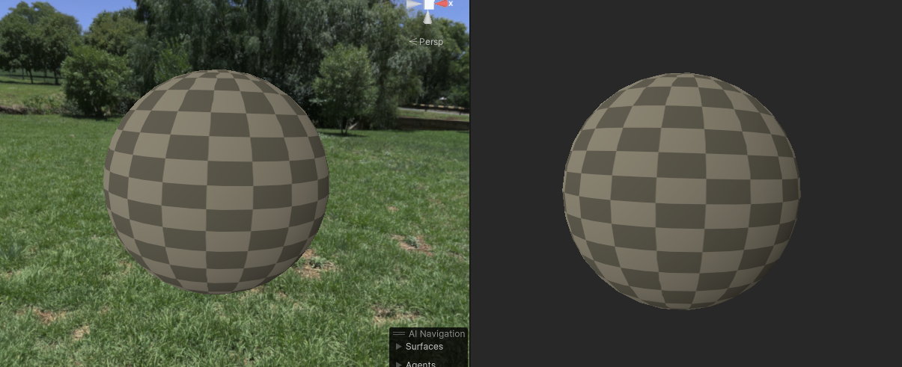
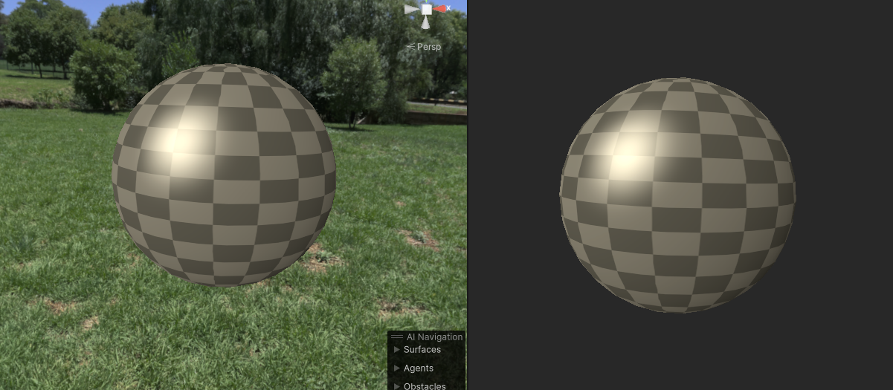
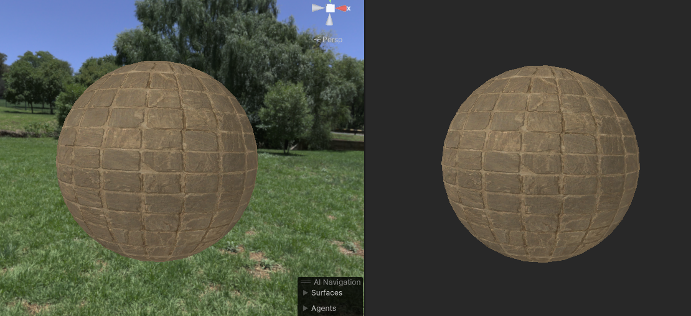
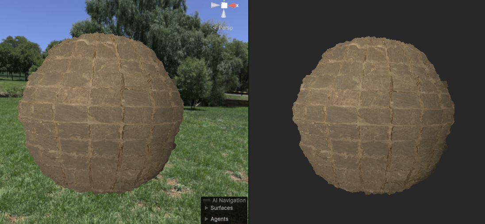
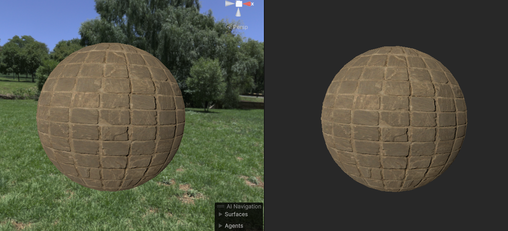
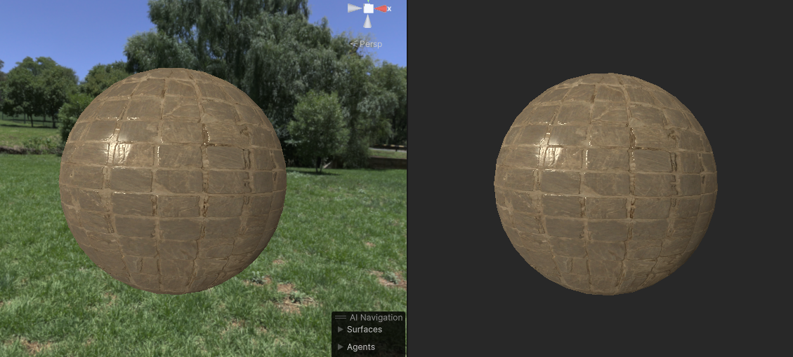
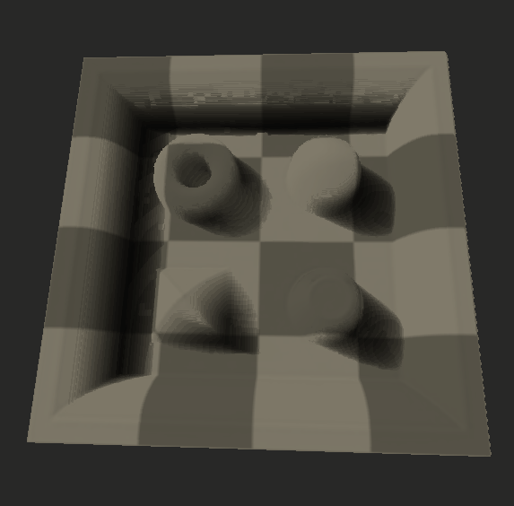

## Shader 代码

使用HLSL语法制作一些Unity Shader代码，避免以后重复制作

> [!IMPORTANT]
>  - Unity版本： URP 2022.3.9f
>  - 测试环境： Win DX11

### 具体效果

  | 名称      | 效果     | 描述       |
  |------------|------------|------------|
  |  [00_HLSLShader](00_Base/Shader/00_HLSLShader.shader) |     | 基础Shader，只转换HLSL语法    |
  |  [01_HLSLShader](00_Base/Shader/01_HLSLShader.shader)   |     | 基础Shader，增加关键字枚举类型切换   |
  | | | | 
  |  [01_Lanbert](01_LightingModel/Shader/01_Lanbert.shader) |  | 漫反射渲染，兰伯特光照模型|
  |  [01_HalfLanbert](01_LightingModel/Shader/01_HalfLanbert.shader) |  | 漫反射渲染，半兰伯特光照模型|
  |  [01_Phong](01_LightingModel/Shader/01_Phong.shader) |  | 高光渲染， 冯光照模型|
  |  [01_BlinnPhong](01_LightingModel/Shader/01_BlinnPhong.shader) |  | 高光模型， 布林-冯光照模型|
  | | | | 
  | [02_BumpMap](02_Bump/Shader/02_BumpMap.shader) |  | 凹凸渲染. 使用高度图渲染凹凸 | 
  | [02_DisplacementMapping](02_Bump/Shader/02_DisplacementMapping.shader)|  |  凹凸渲染.使用曲面细分根据高度图渲染凹凸 | 
  | [02_Normal](02_Bump/Shader/02_Normal.shader)|  |  凹凸渲染. 使用法线贴图渲染凹凸| 
  | [02_ParallaxOcclusion](02_Bump/Shader/02_ParallaxOcclusion.shader)|  | 凹凸渲染. 使用视差渲染凹凸 | 
  | | | | 
  | [03_00_SimpleParallax](03_Parallax/Shader/03_00_SimpleParallax.shader)|   | 视差贴图简单版 | 
  | [03_01_ParallaxMapping](03_Parallax/Shader/03_01_ParallaxMapping.shader)|   | Unity默认视差效果 | 
  | [03_02_SimpleParallaxWithOffsetLimit](03_Parallax/Shader/03_02_SimpleParallaxWithOffsetLimit.shader)|   | 带偏移量限制的视差贴图 | 
  | [03_03_SteepParallaxMapping](03_Parallax/Shader/03_03_SteepParallaxMapping.shader)|   | 陡峭视差贴图 | 
  | [03_04_ReliefParallaxMapping](03_Parallax/Shader/03_04_ReliefParallaxMapping.shader)|   | 浮雕视差贴图 | 
  | [03_05_POMParallaxOcclusionMapping](03_Parallax/Shader/03_05_POMParallaxOcclusionMapping.shader)|   | 视差遮挡贴图 | 
  | [03_06_ParallaxOcclusionMappingNode](03_Parallax/Shader/03_06_ParallaxOcclusionMappingNode.shader)|  | Unity默认效果 ，其中POM效果 | 
  | [03_07_SteepParallaxWithShadow](03_Parallax/Shader/03_07_SteepParallaxWithShadow.shader)|  |   自阴影的视差贴图 | 
  | [03_08_SteepParallaxWithSoftShadow](03_Parallax/Shader/03_08_SteepParallaxWithSoftShadow.shader)|  | 优化阴影， 带自阴影的视差贴图 | 
