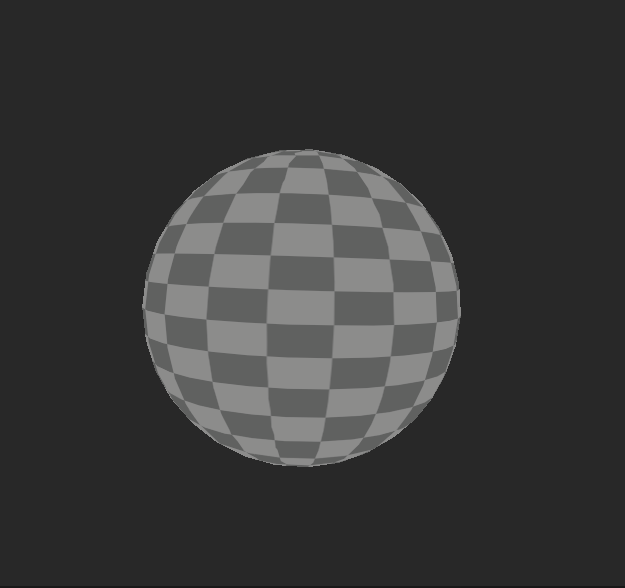

## Shader 代码

制作的的一些过Shader代码，避免以后重复制作

> [!IMPORTANT]
> Unity版本： 2022.3.9f
> URP管线：

### 具体效果

  | 名称      | 效果     | 描述       |
  |------------|------------|------------|
  | 单元格1    |     | 单元格3    |
  | 单元格4    | 单元格5    | 单元格6    |
