## Shader 代码

使用HLSL语法制作一些Unity Shader代码，避免以后重复制作

> [!IMPORTANT]
>  - Unity版本： URP 2022.3.9f
>  - 测试环境： Win DX11

### 具体效果

  | 名称      | 效果     | 描述       |
  |------------|------------|------------|
  |  [00_HLSLShader](00_Base/Shader/00_HLSLShader.shader) |     | 基础Shader，只转换HLSL语法    |
  |  [01_HLSLShader](00_Base/Shader/01_HLSLShader.shader)   |     | 基础Shader，增加关键字枚举类型切换   |
  | | | | 
  |  [01_Lanbert](01_LightingModel/Shader/01_Lanbert.shader) |  | 漫反射渲染，兰伯特光照模型|
  |  [01_HalfLanbert](01_LightingModel/Shader/01_HalfLanbert.shader) |  | 漫反射渲染，半兰伯特光照模型|
  |  [01_Phong](01_LightingModel/Shader/01_Phong.shader) |  | 高光渲染， 冯光照模型|
  |  [01_BlinnPhong](01_LightingModel/Shader/01_BlinnPhong.shader) |  | 高光模型， 布林-冯光照模型|
  | | | | 
  | [02_BumpMap](02_Bump/Shader/02_BumpMap.shader) |  | 凹凸渲染. 使用高度图渲染凹凸 | 
  | [02_DisplacementMapping](02_Bump/Shader/02_DisplacementMapping.shader)|  |  凹凸渲染.使用曲面细分根据高度图渲染凹凸 | 
  | [02_Normal](02_Bump/Shader/02_Normal.shader)|  |  凹凸渲染. 使用法线贴图渲染凹凸| 
  | [02_ParallaxOcclusion](02_Bump/Shader/02_ParallaxOcclusion.shader)|  | 凹凸渲染. 使用视差渲染凹凸 | 
  | | | | 
  | [03_00_SimpleParallax](03_Parallax/Shader/03_00_SimpleParallax.shader)|   | 视差贴图简单版 | 
  | [03_01_ParallaxMapping](03_Parallax/Shader/03_01_ParallaxMapping.shader)|   | Unity默认视差效果 | 
  | [03_02_SimpleParallaxWithOffsetLimit](03_Parallax/Shader/03_02_SimpleParallaxWithOffsetLimit.shader)|   | 带偏移量限制的视差贴图 | 
  | [03_03_SteepParallaxMapping](03_Parallax/Shader/03_03_SteepParallaxMapping.shader)|   | 陡峭视差贴图 | 
  | [03_04_ReliefParallaxMapping](03_Parallax/Shader/03_04_ReliefParallaxMapping.shader)|   | 浮雕视差贴图 | 
  | [03_05_POMParallaxOcclusionMapping](03_Parallax/Shader/03_05_POMParallaxOcclusionMapping.shader)|   | 视差遮挡贴图 | 
  | [03_06_ParallaxOcclusionMappingNode](03_Parallax/Shader/03_06_ParallaxOcclusionMappingNode.shader)|  | Unity默认效果 ，其中POM效果 | 
  | [03_07_SteepParallaxWithShadow](03_Parallax/Shader/03_07_SteepParallaxWithShadow.shader)|  |   自阴影的视差贴图 | 
  | [03_08_SteepParallaxWithSoftShadow](03_Parallax/Shader/03_08_SteepParallaxWithSoftShadow.shader)|  | 优化阴影， 带自阴影的视差贴图 | 
  | [03_Card](03_Parallax/Shader/03_Card.shader)|  | 使用视差的方式实现卡牌效果 | 
  | | | | 
  | [04_01_LightShadow](04_MultipleLightSources/Shader/04_01_LightShadow.shader)| 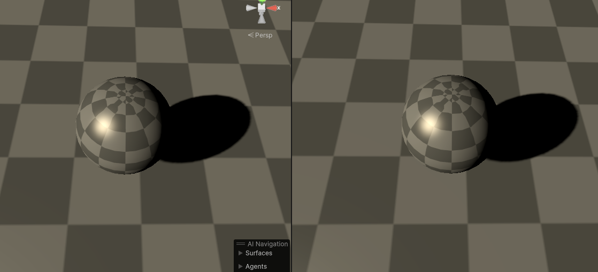 | 基础阴影效果 | 
  | [04_02_SetShadowColor](04_MultipleLightSources/Shader/04_02_SetShadowColor.shader)| 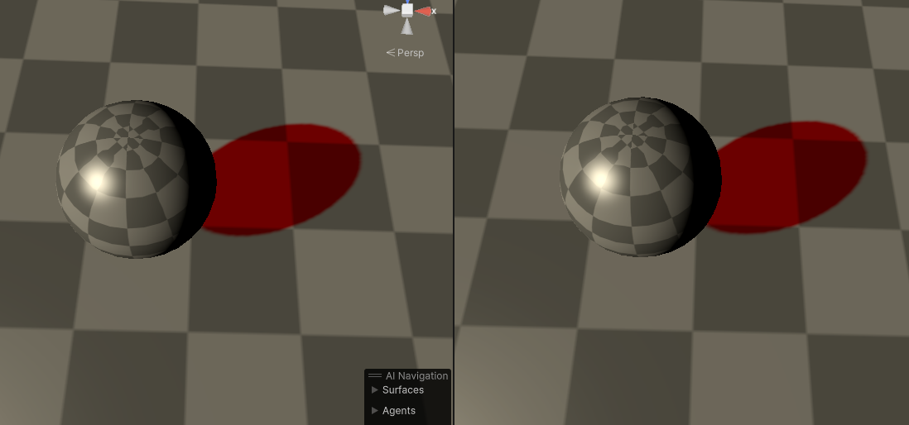 | 自定义阴影颜色效果 | 
  | [04_03_MultipleLitgts](04_MultipleLightSources/Shader/04_03_MultipleLitgts.shader)| 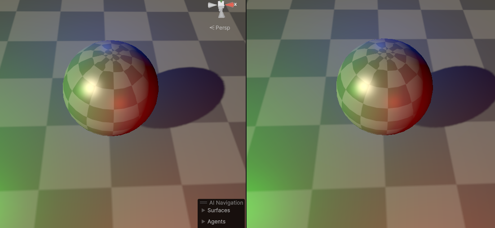| 点光源，多光源效果 | 
  | [04_04_MultipleLitgtsShadows](04_MultipleLightSources/Shader/04_04_MultipleLitgtsShadows.shader)| 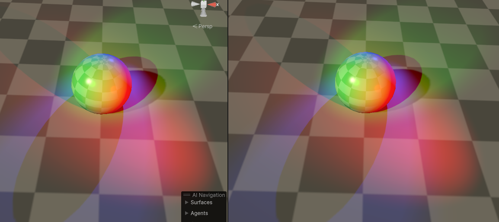 | 多光源阴影效果  | 
  | [04_05_LightBakedShadow](04_MultipleLightSources/Shader/04_05_LightBakedShadow.shader)| 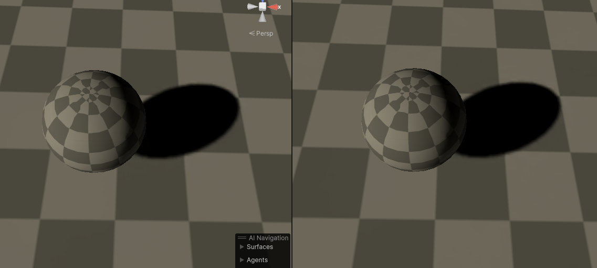 | 烘焙阴影效果 | 
  | | | | 
  | [05_2D](04_MultipleLightSources/Shader/04_05_LightBakedShadow.shader)| 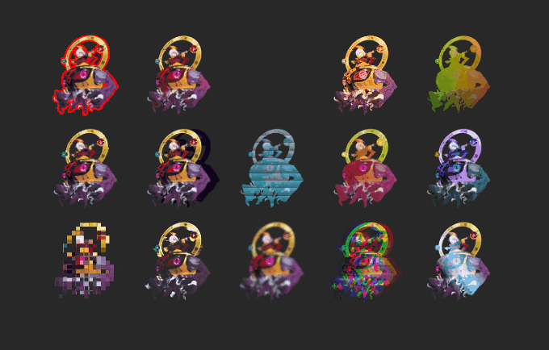 | 2D系列的Shader效果 - 外描边 - 纹理辉光 - 溶解 - 内描边 - 渐变颜色 - 故障 -2D阴影 - 全息投影 - 局部变色 - 色相调整 - 像素 - 鬼魂 - 模糊 - 三色分离 - 扫光| 
  | [06_MathFun](06_MathFun/Shader)| 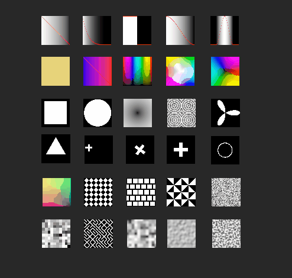 | 基础数学计算，位移-旋转，放大缩小 | 
  | [07_VertexAnimation](07_VertexAnimation/Shader)|  | 使用顶点计算的一些基础动画，没有录视频 | 
  | [08_UV](08_UV)| 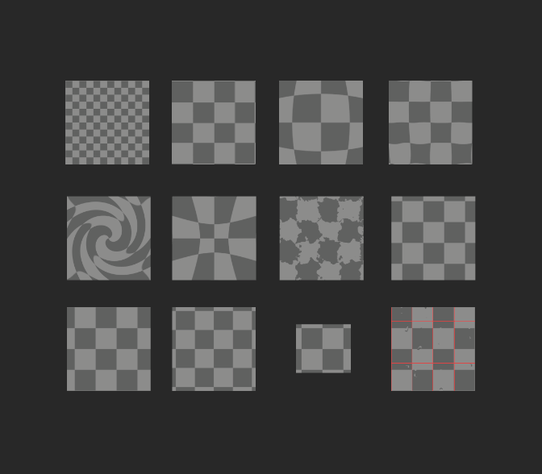 | 贴图UV的一些基础运算 |  
  | | | | 
  | [09_01_PBR材质扩展](09_AlternativeLighting/Shader/PBR)| 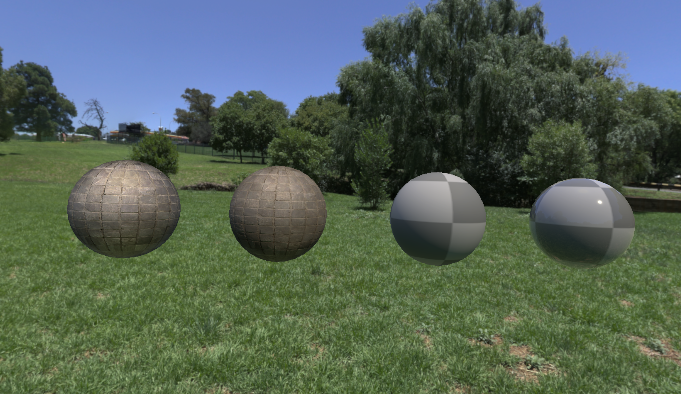 | 包含4个材质，基础PBR，扩展多贴图,增加金属度单独控制 |  
  | [09_02_基础卡通渲染](09_AlternativeLighting)| 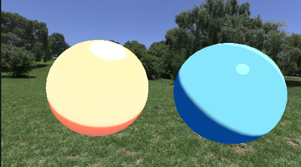 | 两种卡通渲染方法，使用贴图控制过度实现，使用光照计算实现 |  
  | [09_02_自定义Lit](09_AlternativeLighting/Shader/Lit)| 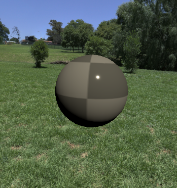 | 两种卡通渲染方法，使用贴图Ramp控制过度实现，使用光照计算实现 |  
  | [09_02_自定义PBR](09_AlternativeLighting/Shader/Lit)| 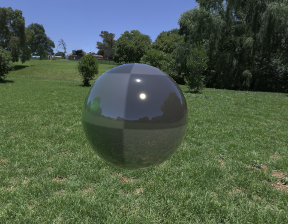 | 根据方法实现的制定PBR，减少不必要的代码 |  
  | | | | 
  | [10_Environment](10_Environment/Shader)|  | 1. 雾   2. 渐变天空盒  3. 场景反射  4. CubeMap反射效果  5. MatCap低性能反射  |  
  | [11_Effect](11_Effect/Shader)| 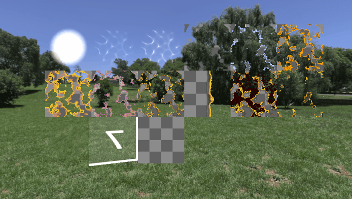 | 特效比较多，大部分和特效叠加有关系  |  
  | [12_01_FlatTessellation](12_Tessellation/Shader/FlatTessellation.shader)| 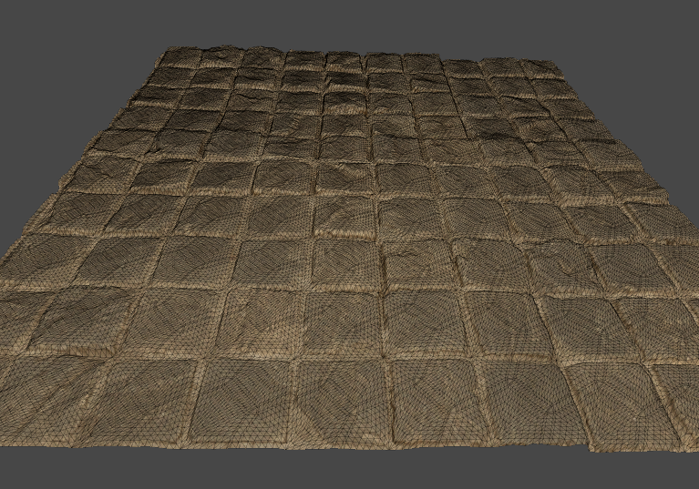 | Flat曲面细分  |  
  | [12_02_PNTessellation](12_Tessellation/Shader/PNTessellation.shader)| 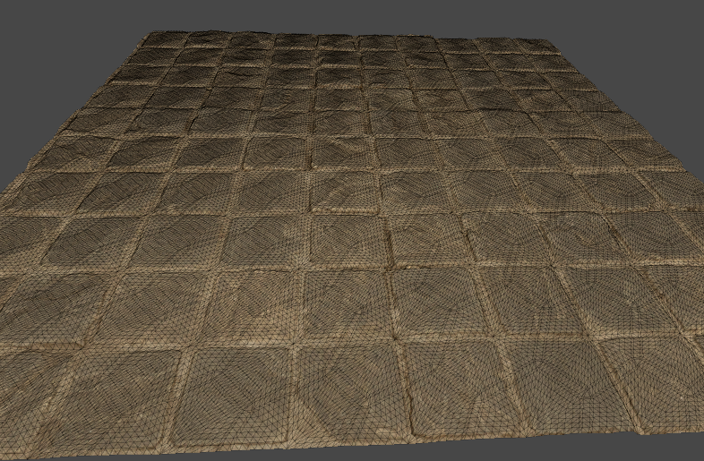 | PNT曲面细分  |  
  | [12_03_PNTessellation](12_Tessellation/Shader/PhongTessellation.shader)| 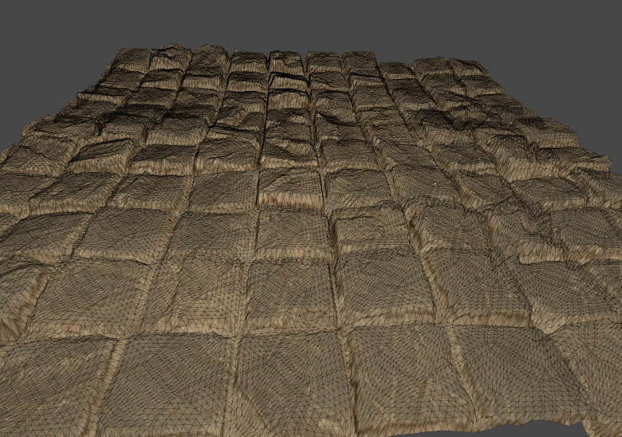 | Phong曲面细分  |  
  | [12_04_TS_CameraDistance](12_Tessellation/Shader/TS_CameraDistance.shader)| 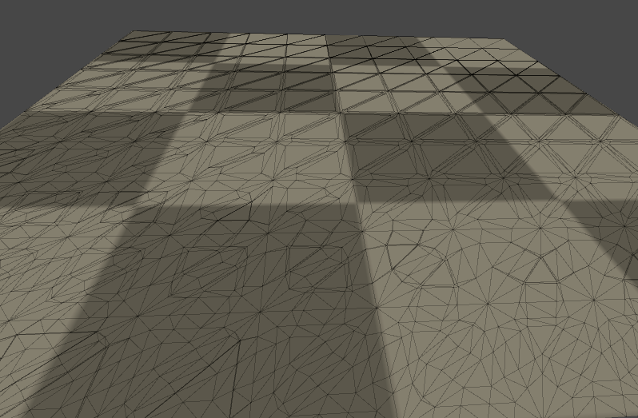 | 屏幕占比进行细分  |  
  | [12_05_TS_ScreenOccupancyRange](12_Tessellation/Shader/TS_ScreenOccupancyRange.shader)| 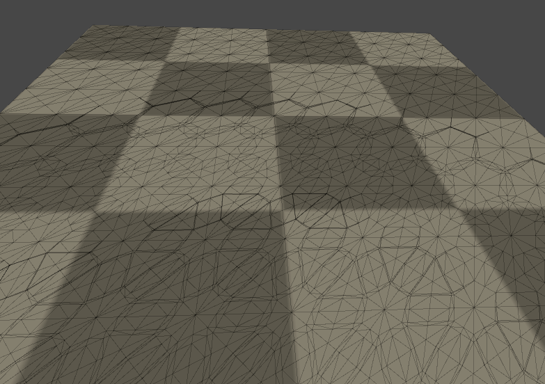 | 摄像机远景控制细分  |  
  | [12_04_TS_TextureBased](12_Tessellation/Shader/TS_TextureBased.shader)| 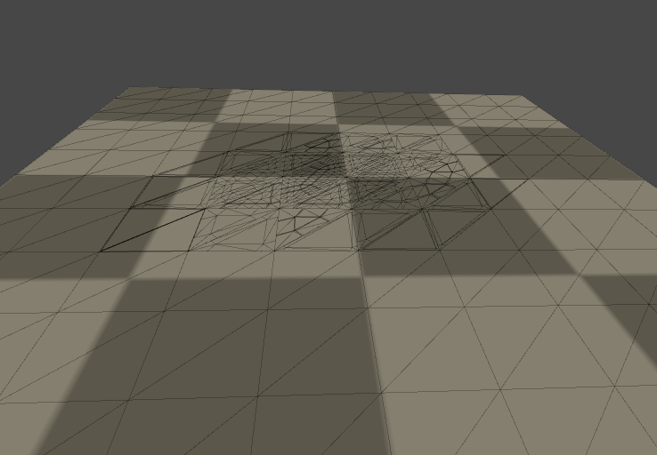 | 屏幕占比进行细分  |  
  | | | | 
  | [13_01_Water](13_Scene/Shader/13_1_Water.shader)| 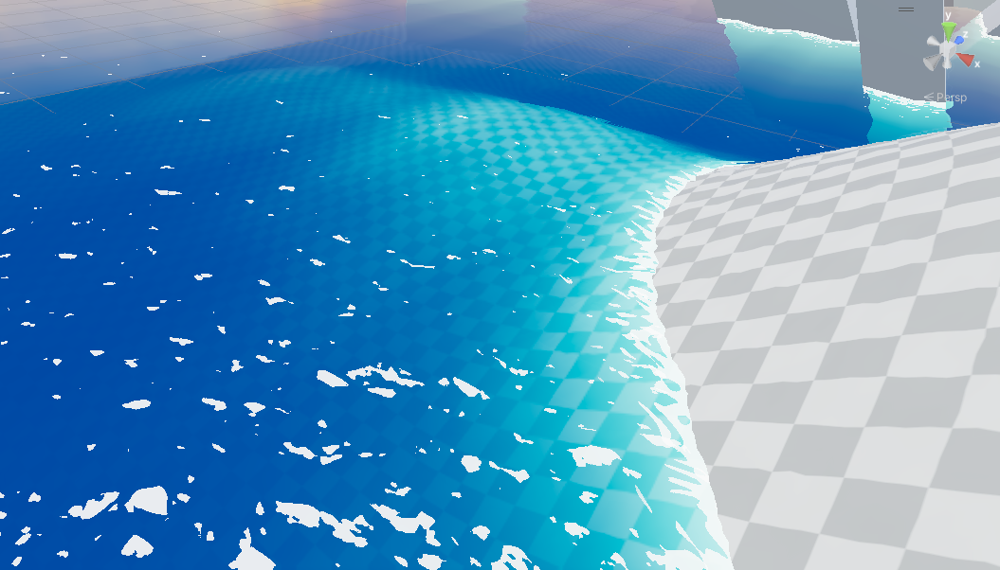 | 卡通水渲染  |  
  | [13_02_Deacl](13_Scene/Shader/13_3_Deacl.shader)| 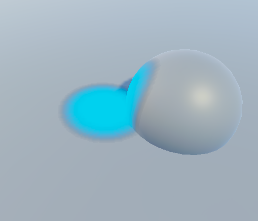 | 场景贴画  |  
  | [13_03_scenarioFog](13_Scene/Shader/13_2_scenarioFog.shader)| 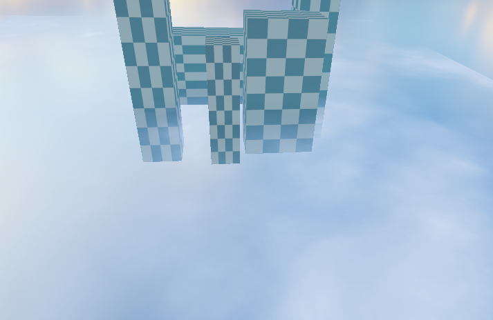 | 场景雾，高度雾  |  
  | [13_4_BakedBumpedSpecularLow](13_Scene/Shader/13_4_BakedBumpedSpecularLow.shader)|  | 基础PBR材质 高度雪，苔藓  |  
  | [13_5_AlphaBlend](13_Scene/Shader/13_5_AlphaBlend.shader)|  | 场景半透明物体，支持雾效，软粒子  |  
  | [13_5_AlphaBlend_Cull](13_Scene/Shader/13_5_AlphaBlend_Cull.shader)|  | 场景半透明物体，支持设置剔除模式（_Cull）  |  
  | | | | 
  | [14_01_NDC](14_Data/Shader/14_NDCPostion.shader)| 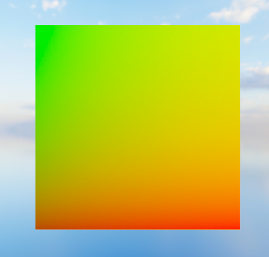 | NDC可视化显示  |  
  | [14_02_NormalBlend](14_Data/Shader/14_NormalBlend.shader)| 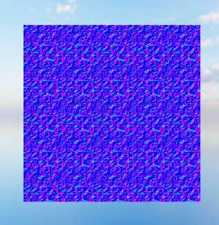 | 两个法线的融合效果  |  
  | [14_03_TangentToWorld](14_Data/Shader/14_NormalTangentToWorld.shader)| 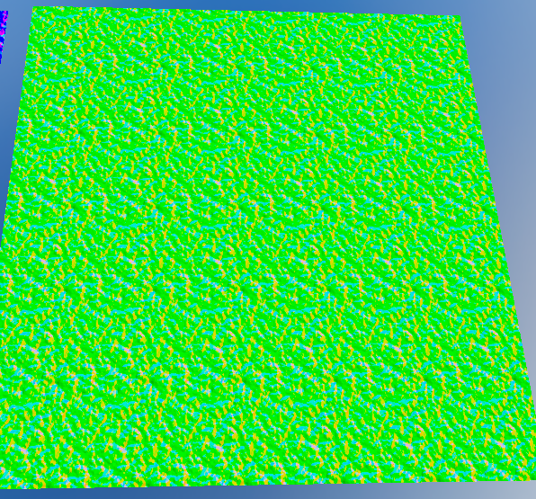 | 切线空间转换成世界空间可视化  |  
  | [14_04_Transform](14_Data/Shader/14_Transform.shader)| 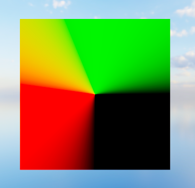 | 对象空间  |  
  | [14_05_SceneColor](14_Data/Shader/14_SceneColor.shader)| 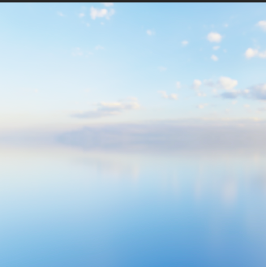 | 场景的颜色  |  
  | [14_06_ViewDirectionWS](14_Data/Shader/14_ViewDirectionWS.shader)| 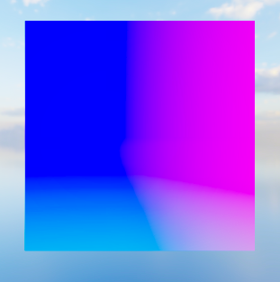 | 视角方向转换成世界空间  |  
